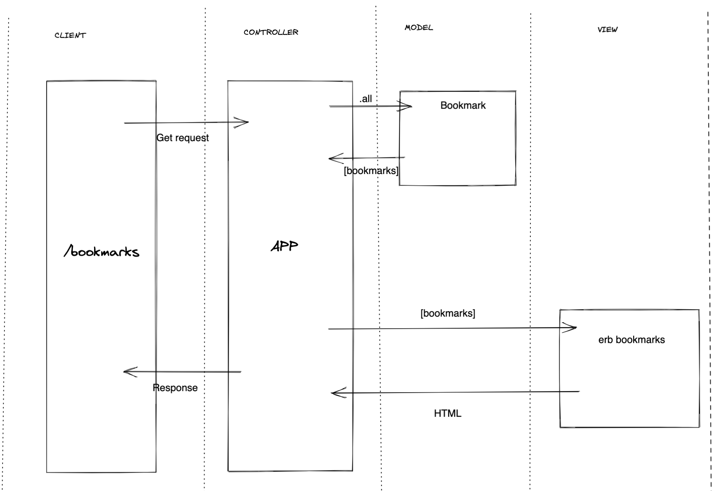

# bookmark_manager

## User Stories

```
> As a user
>So that I can see websites I visit regularly
>I would like to see a list of all bookmarks

```

## Domain Model


## How to use

### To set up the project

Clone this repository and then run:

```
bundle
```

### To run the Bookmark Manager app:

```
rackup
```

### To run tests:

```
rspec
```

### To run linting:

```
rubocop
```

